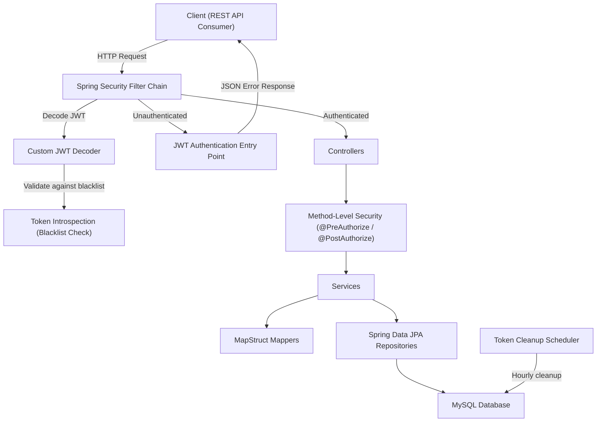
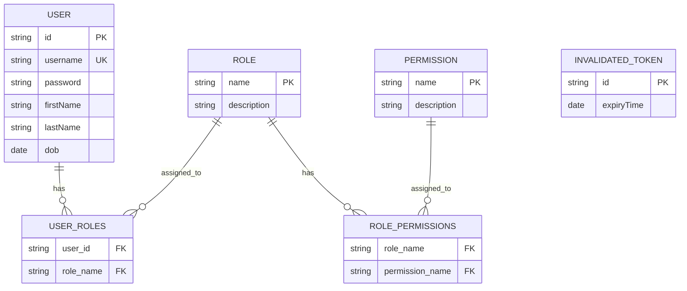

# Identity Service

A RESTful backend service for identity and access management, built with **Java 21** and **Spring Boot 3.2**. The system handles user registration, authentication via JWT, and fine-grained authorization through a role–permission model. It is designed as a standalone backend API with no frontend dependency.

---

## Overview

This project provides a centralized identity management service responsible for:

- **User lifecycle management** — registration, profile retrieval, updates, and deletion.
- **Authentication** — username/password login with JWT issuance, token introspection, refresh, and logout with token blacklisting.
- **Authorization** — role-based access control (RBAC) with granular permissions embedded in JWT claims, enforced at both the HTTP security filter level and individual method level via `@PreAuthorize` / `@PostAuthorize`.

The service follows a layered architecture (Controller → Service → Repository) with clear separation of concerns, DTO-based request/response contracts, and a global exception handling strategy that returns structured JSON error responses.

---

## Features

### Authentication
- Username/password authentication with BCrypt password hashing
- JWT (JSON Web Token) issuance using HMAC-SHA512 (HS512) signing
- Token introspection endpoint to verify token validity
- Token refresh with automatic old-token invalidation
- Logout with JWT blacklisting (invalidated tokens stored in database)
- Scheduled cleanup of expired invalidated tokens

### Authorization
- Role-based access control (RBAC) with `ADMIN` and `USER` roles
- Fine-grained permission system (permissions assigned to roles, roles assigned to users)
- Method-level security using `@PreAuthorize` and `@PostAuthorize`
- JWT `scope` claim contains both roles (prefixed with `ROLE_`) and individual permissions
- Custom `JwtAuthenticationConverter` that maps JWT scope claims to Spring Security authorities

### User Management
- User registration with automatic `USER` role assignment
- Duplicate username detection
- Get current authenticated user's profile (`/users/myInfo`)
- Admin-only: list all users, get user by ID, update user, delete user

### Role & Permission Management
- CRUD operations for permissions (admin-only)
- CRUD operations for roles with permission assignment (admin-only)
- Many-to-many relationship: Users ↔ Roles ↔ Permissions

### Security
- Custom `JwtDecoder` that validates tokens against the blacklist before decoding
- Custom `AuthenticationEntryPoint` returning structured JSON error responses for unauthenticated requests
- Public endpoints restricted to POST only (registration and auth operations)
- All other endpoints require a valid JWT
- CSRF disabled (appropriate for stateless REST APIs)
- CORS configured for cross-origin requests
- Default admin user seeded on first startup with a warning to change the password

### Validation & Exception Handling
- Bean Validation with `@Size` constraints on username and password
- Custom `@DobConstraint` annotation for minimum age validation on date of birth
- Global exception handler (`@ControllerAdvice`) with structured `ApiResponse` error format
- Dynamic error message interpolation (e.g., `"Username must be at least {min} characters"`)
- Dedicated handlers for: `AppException`, `MethodArgumentNotValidException`, `AccessDeniedException`, and generic exceptions
- Enum-based error codes with associated HTTP status codes

### Code Quality
- Spotless Maven plugin for consistent code formatting (Palantir Java Format)
- JaCoCo for test coverage reporting (excludes DTOs, entities, mappers, and configuration)

---

## Tech Stack

| Category           | Technology                                                        |
|--------------------|-------------------------------------------------------------------|
| Language           | Java 21                                                           |
| Framework          | Spring Boot 3.2.2                                                 |
| Security           | Spring Security, Spring OAuth2 Resource Server, Nimbus JOSE+JWT   |
| Database           | MySQL 8                                                           |
| ORM                | Spring Data JPA / Hibernate                                       |
| Mapping            | MapStruct 1.6.3                                                   |
| Validation         | Jakarta Bean Validation (Hibernate Validator)                     |
| Testing            | JUnit 5, Mockito, MockMvc, Spring Security Test, Testcontainers   |
| Test Database      | H2 (unit tests), MySQL via Testcontainers (integration tests)     |
| Code Coverage      | JaCoCo 0.8.12                                                     |
| Code Formatting    | Spotless (Palantir Java Format)                                   |
| Build Tool         | Maven                                                             |
| Containerization   | Docker (multi-stage build)                                        |
| Utilities          | Lombok 1.18.38, Jackson (with JSR-310 JavaTimeModule)             |

---

## Architecture



### Entity Relationship



---

## Project Structure

```
src/main/java/com/devteria/identityservice/
├── IdentityServiceApplication.java          # Application entry point (@EnableScheduling)
├── configuration/
│   ├── ApplicationInitConfig.java           # Seeds default admin user and roles on startup
│   ├── CustomJwtDecoder.java                # JWT decoder with blacklist validation
│   ├── JwtAuthenticationEntryPoint.java     # Custom 401 error response handler
│   └── SecurityConfig.java                  # Security filter chain, CORS, password encoder
├── controller/
│   ├── AuthenticationController.java        # /auth endpoints (login, introspect, refresh, logout)
│   ├── PermissionController.java            # /permissions CRUD endpoints
│   ├── RoleController.java                  # /roles CRUD endpoints
│   └── UserController.java                  # /users CRUD + myInfo endpoints
├── dto/
│   ├── request/                             # Request DTOs with validation annotations
│   └── response/                            # Response DTOs (ApiResponse wrapper, entity responses)
├── entity/
│   ├── InvalidatedToken.java               # JWT blacklist entity
│   ├── Permission.java                      # Permission entity
│   ├── Role.java                            # Role entity (ManyToMany → Permission)
│   └── User.java                            # User entity (ManyToMany → Role)
├── enums/
│   └── Role.java                            # Role enum (ADMIN, USER)
├── exception/
│   ├── AppException.java                    # Custom runtime exception
│   ├── ErrorCode.java                       # Error code enum with HTTP status mapping
│   └── GlobalExceptionHandler.java          # @ControllerAdvice global exception handler
├── mapper/
│   ├── PermissionMapper.java                # MapStruct: Permission ↔ DTO
│   ├── RoleMapper.java                      # MapStruct: Role ↔ DTO
│   └── UserMapper.java                      # MapStruct: User ↔ DTO
├── repository/
│   ├── InvalidatedTokenRepository.java      # JPA repository with expired token cleanup query
│   ├── PermissionRepository.java
│   ├── RoleRepository.java
│   └── UserRepository.java                  # Custom queries: findByUsername, existsByUsername
├── scheduler/
│   └── TokenCleanupScheduler.java           # Scheduled job to purge expired blacklisted tokens
├── service/
│   ├── AuthenticationService.java           # Login, JWT generation, introspection, refresh, logout
│   ├── PermissionService.java               # Permission CRUD logic
│   ├── RoleService.java                     # Role CRUD logic with permission resolution
│   └── UserService.java                     # User CRUD, registration, profile retrieval
└── validator/
    ├── DobConstraint.java                   # Custom annotation for minimum age validation
    └── DobValidator.java                    # Constraint validator implementation
```

---

## API Endpoints

### Authentication (`/auth`)

| Method | Endpoint           | Auth     | Description                                    |
|--------|--------------------|----------|------------------------------------------------|
| POST   | `/auth/token`      | Public   | Authenticate with username/password, get JWT   |
| POST   | `/auth/introspect` | Public   | Verify if a JWT is still valid                 |
| POST   | `/auth/refresh`    | Public   | Refresh an access token (invalidates old one)  |
| POST   | `/auth/logout`     | Public   | Invalidate a JWT (add to blacklist)            |

### Users (`/users`)

| Method | Endpoint           | Auth          | Description                        |
|--------|--------------------| ------------- |------------------------------------|
| POST   | `/users`           | Public        | Register a new user                |
| GET    | `/users`           | Authenticated | List all users                     |
| GET    | `/users/{userId}`  | Authenticated | Get user by ID                     |
| GET    | `/users/myInfo`    | Authenticated | Get current user's profile         |
| PUT    | `/users/{userId}`  | Authenticated | Update a user                      |
| DELETE | `/users/{userId}`  | Authenticated | Delete a user                      |

### Roles (`/roles`)

| Method | Endpoint         | Auth  | Description                              |
|--------|------------------|-------|------------------------------------------|
| POST   | `/roles`         | Admin | Create a role with permissions           |
| GET    | `/roles`         | Admin | List all roles                           |
| DELETE | `/roles/{role}`  | Admin | Delete a role                            |

### Permissions (`/permissions`)

| Method | Endpoint                    | Auth  | Description            |
|--------|-----------------------------|-------|------------------------|
| POST   | `/permissions`              | Admin | Create a permission    |
| GET    | `/permissions`              | Admin | List all permissions   |
| DELETE | `/permissions/{permission}` | Admin | Delete a permission    |

### API Response Format

All endpoints return responses wrapped in a standard `ApiResponse` structure:

```json
{
  "code": 1000,
  "message": null,
  "result": { }
}
```

- `code: 1000` indicates success
- On errors, `code` maps to a specific `ErrorCode` and `message` contains the error description
- `result` is omitted (null-excluded) when not applicable

### Error Codes

| Code | Name                    | HTTP Status | Description                              |
|------|-------------------------|-------------|------------------------------------------|
| 9999 | UNCATEGORIZED_EXCEPTION | 500         | Unexpected server error                  |
| 1002 | USER_EXISTED            | 400         | Username already taken                   |
| 1003 | USERNAME_INVALID        | 400         | Username too short (min characters)      |
| 1004 | PASSWORD_INVALID        | 400         | Password too short (min characters)      |
| 1005 | USER_NOT_EXISTED        | 404         | User not found                           |
| 1006 | UNAUTHENTICATED         | 401         | Invalid or expired token                 |
| 1007 | UNAUTHORIZED            | 403         | Insufficient permissions                 |
| 1008 | INVALID_DOB             | 400         | Age below minimum requirement            |

---

## Getting Started

### Prerequisites

- **Java 21** (JDK)
- **Maven 3.9+**
- **MySQL 8** (or Docker)

### Database Setup

Create a MySQL database:

```sql
CREATE DATABASE identity_service;
```

### Configuration

The application uses the following configuration in `src/main/resources/application.yaml`:

```yaml
server:
  port: 8080

spring:
  datasource:
    url: "jdbc:mysql://localhost:3306/identity_service"
    driverClassName: "com.mysql.cj.jdbc.Driver"
    username: root
    password: root
  jpa:
    hibernate:
      ddl-auto: update

jwt:
  signerKey: "<your-secret-key>"
  valid-duration: 3600       # Access token validity in seconds (1 hour)
  refreshable-duration: 36000 # Refresh window in seconds (10 hours)
```

> **Note:** Update `spring.datasource.url`, `username`, `password`, and `jwt.signerKey` for your environment. The signer key should be a sufficiently long, random secret.

### Run the Application

```bash
./mvnw spring-boot:run
```

The application starts on `http://localhost:8080`.

On first startup with MySQL, a default admin user is created:
- **Username:** `admin`
- **Password:** `admin`


### Run with Docker

The project includes a multi-stage `Dockerfile`:

```bash
# Build and run the Docker image
docker build -t identity-service .
docker run -p 8080:8080 identity-service
```

> **Note:** The Dockerfile builds the application from source using Maven and runs it on Amazon Corretto JDK 21. Ensure the application can connect to a MySQL instance (update `spring.datasource.url` as needed, e.g., via environment variables).

---

## Testing

The project includes both unit tests and integration tests:

### Unit Tests
- **UserServiceTest** — Tests service-layer business logic with mocked repositories
  - User creation (success and duplicate detection)
  - Get current user's profile (success and user-not-found)
  - Uses `@WithMockUser` for security context simulation

### Controller Tests
- **UserControllerTest** — MockMvc-based tests for the user controller
  - Valid user creation request
  - Username validation failure
  - Password validation failure
  - Validates structured `ApiResponse` JSON output

### Integration Tests
- **UserIntegrationControllerTest** — Full integration test using **Testcontainers** with a real MySQL 8 Docker container
  - Tests the complete request flow from HTTP through to database persistence
  - Uses `@DynamicPropertySource` to inject container connection properties

### Running Tests

```bash
# Run all tests
./mvnw test

# Run tests with coverage report
./mvnw verify
```

Coverage reports are generated by JaCoCo at `target/site/jacoco/index.html`.

> **Note:** Integration tests require Docker to be running (for Testcontainers).

---

## License

This project is for educational and portfolio demonstration purposes.
